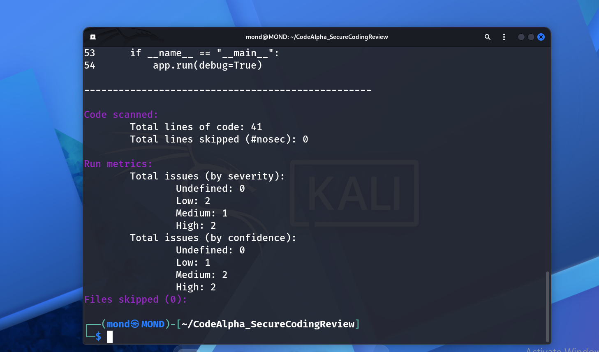
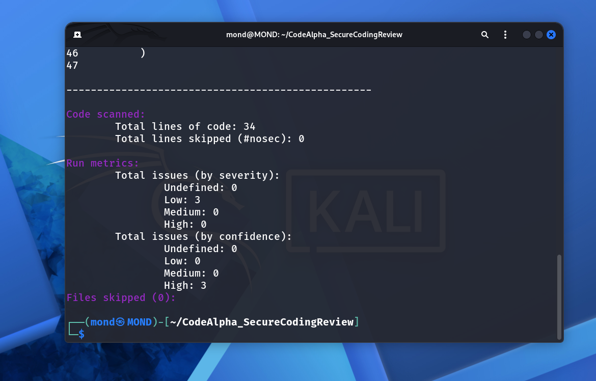

# CodeAlpha Secure Coding Review

## Overview

This project demonstrates a secure coding review of a vulnerable Python Flask application.

The project focuses on identifying common security vulnerabilities using static analysis with Bandit, manually reviewing the source code, and implementing secure coding fixes.

## Objectives

- Identify common Python security vulnerabilities.
- Perform static security analysis using Bandit.
- Analyze vulnerable source code.
- Apply secure coding practices.
- Compare vulnerable and secure implementations.
- Verify that high and medium severity findings are removed after remediation.

## Technologies Used

- Python
- Flask
- SQLite
- Bandit
- Linux / Kali Linux
- Secure Coding Practices

## Security Analysis

Bandit was used to analyze the vulnerable application.

### Initial Scan

The vulnerable application contained the following security issues:

- Command Injection risk through `subprocess` with `shell=True`
- SQL Injection risk through string-based SQL queries
- Hardcoded secret
- Flask debug mode enabled
- Unsafe subprocess usage

### Initial Bandit Results

- High severity: **2**
- Medium severity: **1**
- Low severity: **2**



## Security Remediation

The vulnerable application was rewritten using secure coding practices.

### SQL Injection Prevention

Parameterized SQL queries were used instead of string concatenation.

### Command Injection Prevention

The dangerous `shell=True` usage was removed and command arguments were passed as a list.

### Secret Management

The hardcoded secret was replaced with an environment variable.

### Flask Debug Mode

Debug mode was disabled:

```python
app.run(debug=False)
````

### Process Execution Safety

A timeout was added to the subprocess call to prevent long-running processes.

## Secure Analysis Results

After applying the security fixes, Bandit was executed again against the secure implementation.

### Final Bandit Results

* High severity: **0**
* Medium severity: **0**
* Low severity: **3**



The remaining low-severity findings are related to the use of the `subprocess` module itself and do not include the original high or medium severity vulnerabilities.

## Vulnerable vs Secure Implementation

| Security Area     | Vulnerable Version              | Secure Version                   |
| ----------------- | ------------------------------- | -------------------------------- |
| SQL Queries       | String-based query construction | Parameterized queries            |
| Command Execution | `shell=True`                    | Argument list with `shell=False` |
| Secret Management | Hardcoded secret                | Environment variable             |
| Flask Debug Mode  | Enabled                         | Disabled                         |
| Process Timeout   | Not configured                  | 5-second timeout                 |

## Project Structure

```text
CodeAlpha_SecureCodingReview/
│
├── vulnerable_app.py
├── secure_app.py
├── bandit-vulnerable-report.png
├── bandit-secure-report.png
└── README.md
```

## Results

The project successfully demonstrated:

* Static security analysis using Bandit
* Identification of Python security vulnerabilities
* Manual secure code review
* SQL Injection remediation
* Command Injection remediation
* Secure secret management
* Secure Flask configuration
* Verification of security improvements

The initial Bandit scan identified **2 High, 1 Medium, and 2 Low** severity findings.

After remediation, the secure implementation contained **0 High, 0 Medium, and 3 Low** severity findings.

## Internship

This project was developed as part of the **CodeAlpha Cyber Security Internship**.

**Task:** Secure Coding Review

**Focus:** Python Application Security and Secure Coding Practices

```
```
